# Agent Mike — Live exploration walkthrough

Stack used for this guide (already running locally):

| Service | URL |
|---|---|
| Manager console + widget | http://localhost:3000 |
| API + OpenAPI docs | http://localhost:8000 · http://localhost:8000/docs |
| Health | http://localhost:8000/health → `demo_mode: true` |

Screenshots were captured with Playwright and annotated in-page (orange rings + banners). Files live in [`screenshots/`](./screenshots/).

**Demo mode note:** With `DEMO_MODE=true` and no Anthropic key, Mike answers from retrieved knowledge excerpts (`_demo_answer`). Escalation terms still fire. Nylas does **not** send real email (`delivery_id: null`).

---

## The three input entry points

```text
① Customer email ── POST /api/v1/webhooks/nylas ─┐
② Website /widget ── POST /api/v1/chat ──────────┼── Next.js API
③ Manager console ── REST /api/v1/* ─────────────┘
```

| # | Entry point | Who | Typical scenario in this guide |
|---|---|---|---|
| ① | Nylas webhook | Customer | “Sign-in code never arrived” email; “Need a refund” email |
| ② | `/widget` | Customer | “How do sign-in codes work?” in the embed |
| ③ | Console (`/`, `/chat`, `/inbox`, `/knowledge`, `/settings`) | Manager | Load knowledge, test chat, take over, tune guardrails |

Shared agent path for ① and ②: `routes.py` → `run_agent()` → `guardrails.evaluate_message` → `knowledge.retrieve` → demo or Claude → persist `Message` → `_apply_outcome`.

---

## Prep: knowledge (manager console)

Without knowledge, demo answers escalate on low confidence. A sample OKF doc was ingested for this walkthrough (`guides/sign-in`).

### What to do

1. Open **Knowledge** (`/knowledge`).
2. Confirm **Sign-in and access codes** is listed (or upload `knowledge/guides/sign-in.md`).
3. Optional: use **Validate and ingest** for PDF/MD/TXT.

### Backend

- `GET /api/v1/knowledge`
- Upload → `POST /api/v1/knowledge/ingest-files`
- Services: `services/knowledge.py` (`ingest_okf` / `ingest_upload`)

### Expect / verify

- Document status **Ready**, chunk count &gt; 0.
- API: `curl -s localhost:8000/api/v1/knowledge | jq '.[].title'`

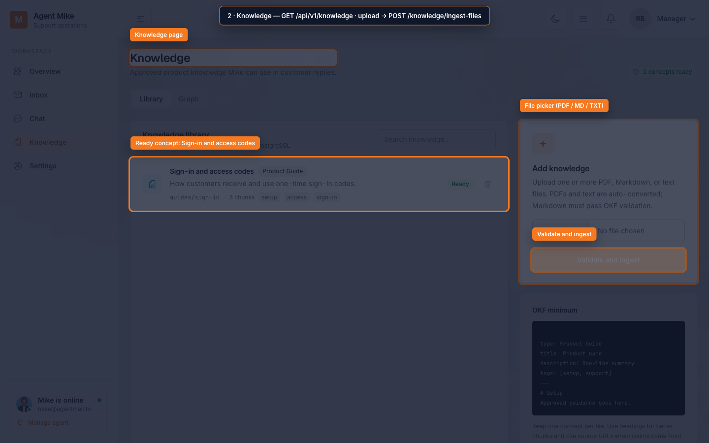

---

## Scenario A — Website widget (entry point ②)

**Story:** A visitor on your site asks how sign-in codes work. Mike retrieves the OKF guide and replies with citations.

### Steps

| Step | Screen / control | Data to enter | Backend |
|---|---|---|---|
| A1 | Open http://localhost:3000/widget | — | Page load only |
| A2 | Message field + **Send** | `How do sign-in codes work?` | `POST /api/v1/chat` → `run_agent` → `retrieve` → demo answer |
| A3 | Open **Inbox** | — | `GET /api/v1/conversations` — look for `channel: chat` |

### Expect

- Instant agent reply with excerpt from the sign-in guide.
- Citation chips: **Sign-in and access codes**.
- New conversation `channel=chat`, ticket like `EAPX-10xx`.
- In demo mode, high retrieval score → usually **open** (not escalated).

### Verify

```bash
curl -s localhost:8000/api/v1/conversations | jq '.[] | select(.channel=="chat") | {subject,status,confidence}'
```

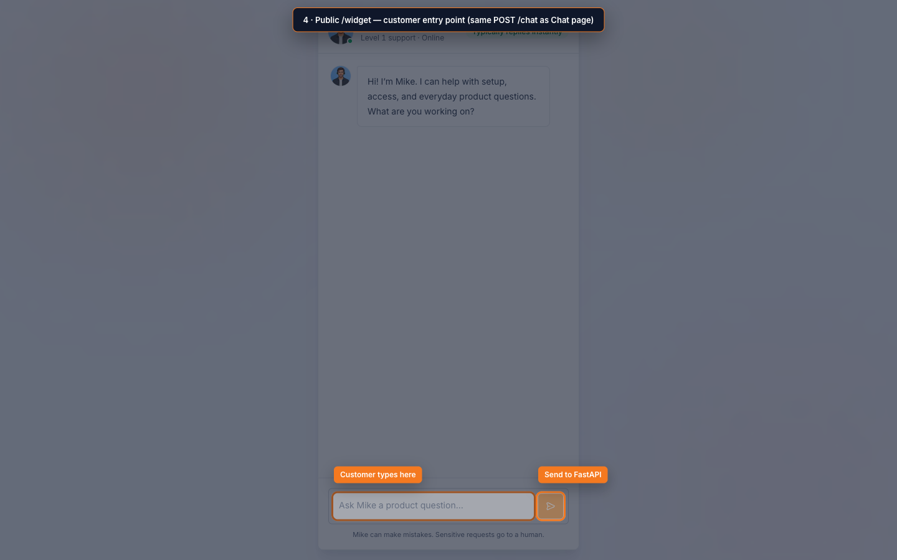

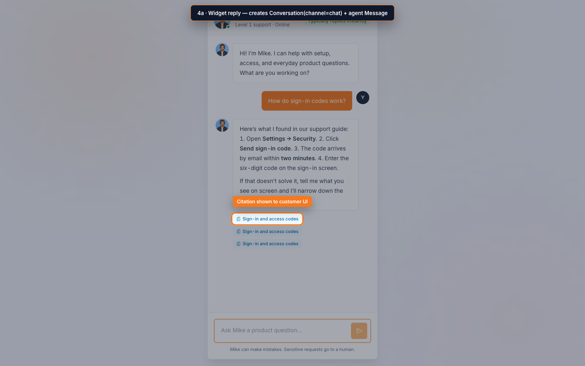

---

## Scenario B — Manager chat test bench (entry point ③ → same `/chat` API)

**Story:** You rehearse the customer experience from the console, then force an escalation.

### B1 — Product question (happy path)

| Control | Value |
|---|---|
| Nav | **Chat** |
| Message | `My sign-in code never arrived. What should I do?` |
| Control | Send (paper-plane) |

**Triggered:** `POST /api/v1/chat` → `knowledge.retrieve` (OR full-text) → `_demo_answer` with citations.

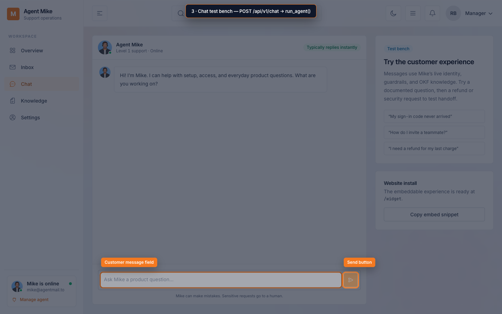

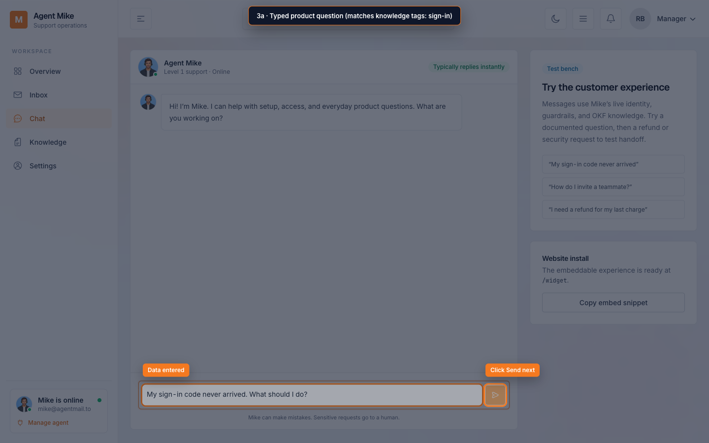

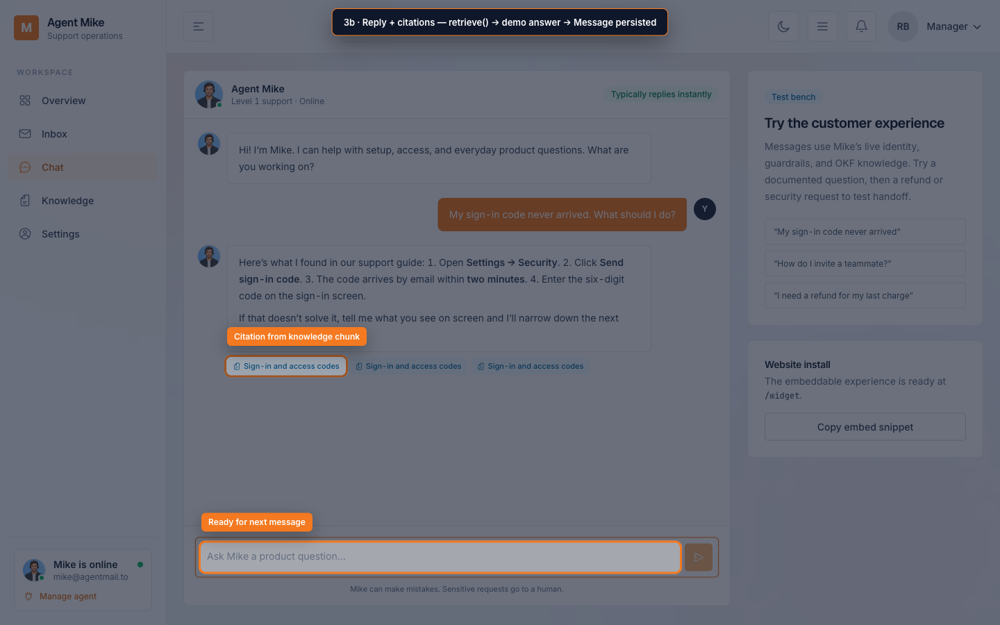

### B2 — Escalation phrase

| Control | Value |
|---|---|
| Same thread | `I need a refund for my last charge` |

**Triggered:** `guardrails.evaluate_message` matches `refund` → escalate **before** Claude → status `needs_human`, priority `high`. Badge: **Manager notified**.

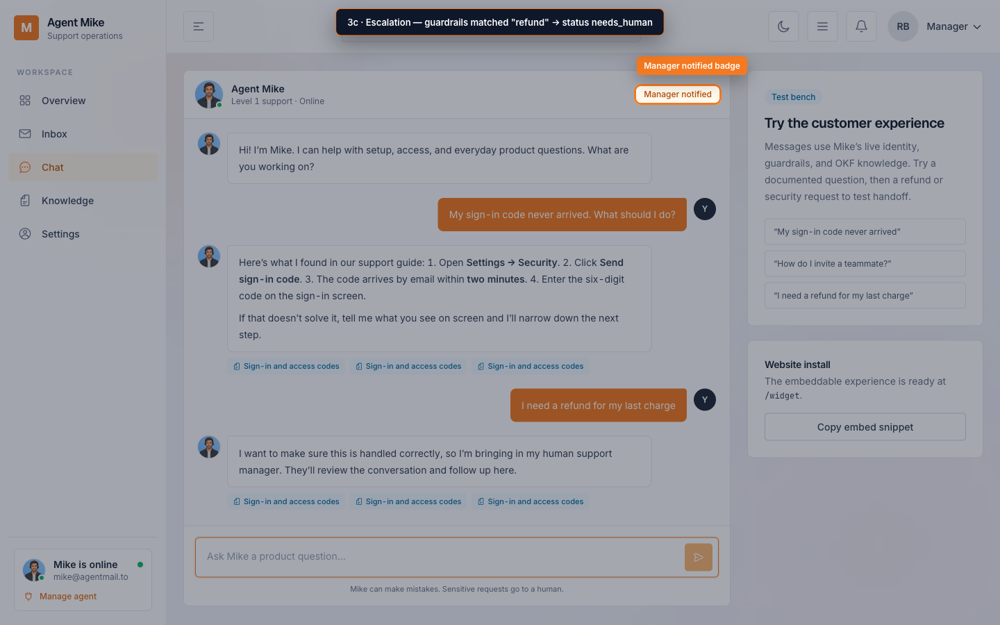

### Verify

```bash
curl -s 'localhost:8000/api/v1/conversations?conversation_status=needs_human' | jq '.[].subject'
```

---

## Scenario C — Customer email via Nylas webhook (entry point ①)

**Story:** Nylas posts inbound mail to your API. In demo mode there is no signature secret requirement and no real outbound send.

### C1 — Answerable email

```bash
curl -s -X POST localhost:3000/api/v1/webhooks/nylas \
  -H 'Content-Type: application/json' \
  -d '{
    "type": "message.created",
    "data": {
      "object": {
        "id": "demo-mail-signin-1",
        "thread_id": "thread-signin-1",
        "from": [{ "name": "Alex Customer", "email": "alex@example.com" }],
        "to": [{ "email": "agent.mike@wkr.email" }],
        "subject": "Sign-in code never arrived",
        "snippet": "Hi Mike, my sign-in code never arrived. Can you help?",
        "body": "<p>Hi Mike, my sign-in code never arrived. Can you help?</p>"
      }
    }
  }'
```

**Expect JSON:** `accepted: true`, `escalated: false`, `delivery_id: null` (demo / no Nylas keys).

**Pipeline:** `verifyWebhook` → parse message → `Conversation(channel=email)` → `runAgent` → persist → `replyToEmail` skipped when not configured.

### C2 — Escalation email

Same endpoint with body containing `refund` (e.g. subject “Need a refund”). Expect `escalated: true`.

### UI check

Open **Inbox** → find **Alex Customer** / **Pat Billing** with channel **email**.

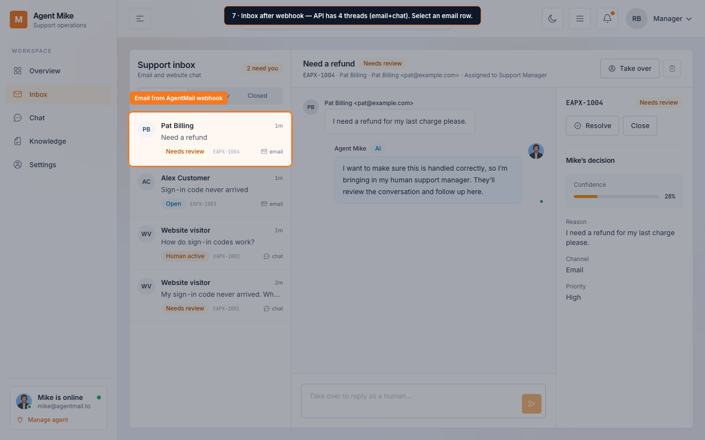

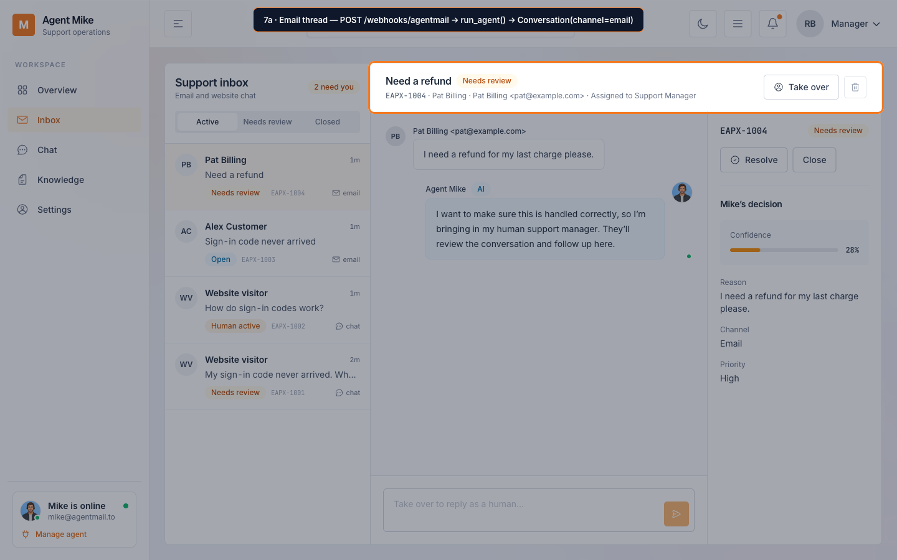

---

## Scenario D — Manager oversight (entry point ③)

**Story:** Review escalations, take over, inspect confidence.

### Steps

| Step | Control | API |
|---|---|---|
| D1 | **Inbox** → filter **Needs review** | `GET /conversations` (client filters) |
| D2 | Select thread | local selection |
| D3 | **Take over** | `PATCH /conversations/{id}/status?conversation_status=human_active` |
| D4 | Reply box | **Local only** — not persisted / not emailed (by design today) |
| D5 | **Resolve** / **Close** | same status PATCH |

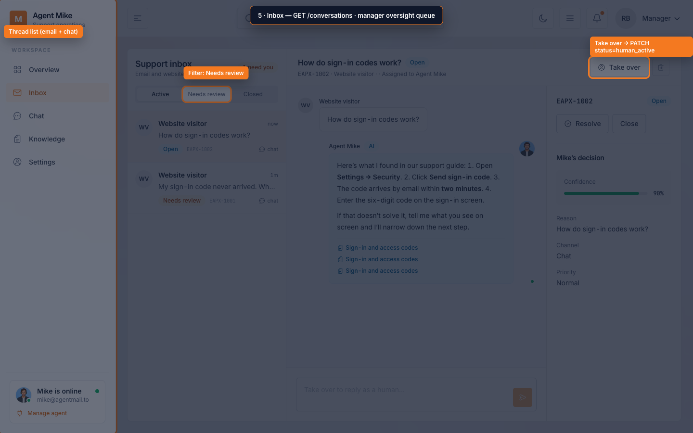

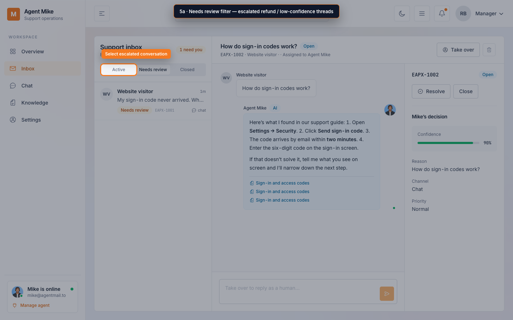

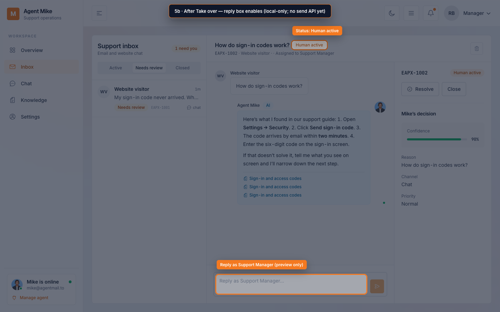

**Header bell:** `NotificationDropdown` → `GET /conversations?conversation_status=needs_human`.

---

## Scenario E — Settings (entry point ③)

**Story:** Change identity / guardrails that feed the system prompt and deterministic checks.

| Section | What to try | API |
|---|---|---|
| Identity | Display name, tone, support email | `PATCH /api/v1/agent` |
| Role | Level 1 scope text | same |
| Guardrails | Confidence slider; add/remove escalation phrases | same |
| Save changes | Persist | `PATCH /agent` |

**Important:** Confidence threshold gates auto-escalate in **demo mode** only. Integrations badges are hardcoded “Configured/Healthy”.

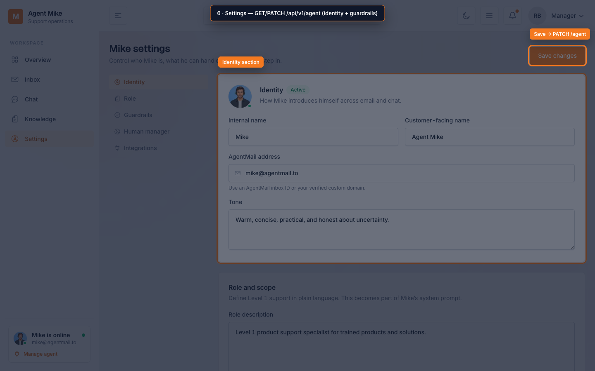

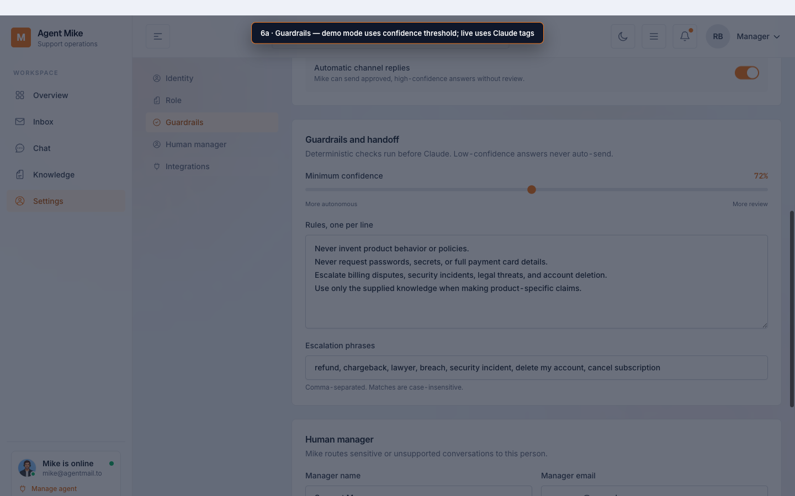

---

## Overview after traffic

**Overview** (`/`) loads `GET /dashboard`, `/conversations`, `/knowledge`. After the scenarios above you should see open / needs-review counts and recent threads.

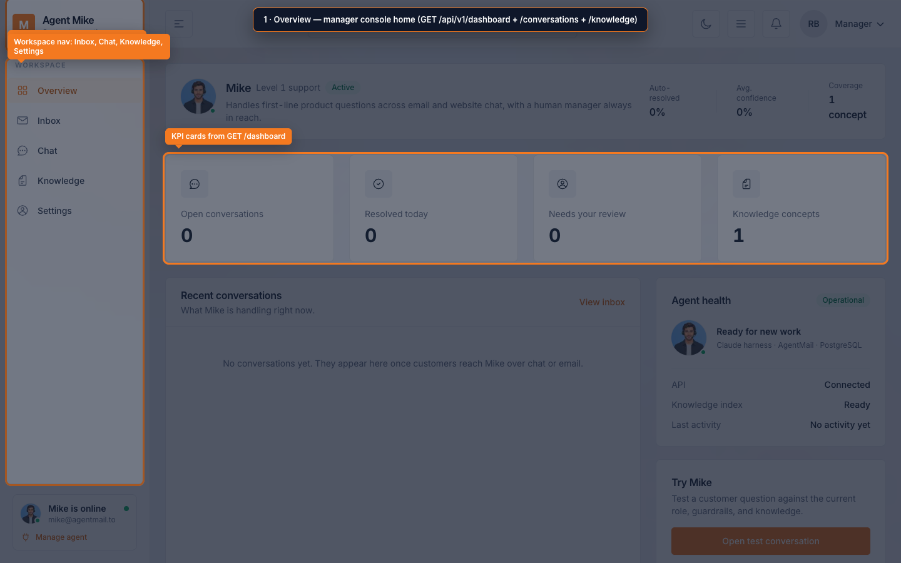

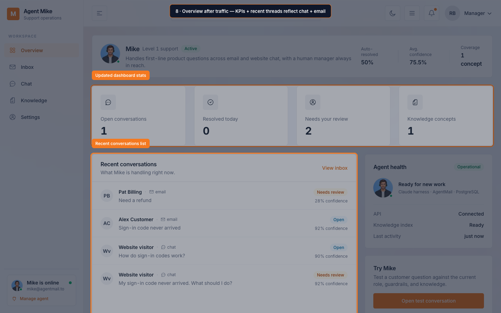

---

## End-to-end checklist (what “works” means here)

| Flow | Pass criteria observed in this run |
|---|---|
| Knowledge ingest | Sign-in concept listed; chunk_count ≥ 1 |
| Widget / Chat answer | Demo excerpt + citation chips; row in Inbox `channel=chat` |
| Escalation | “refund” → Manager notified / Needs review |
| Email webhook | `accepted: true`; Inbox shows `channel=email` (Alex / Pat) |
| Take over | Status **Human active**; reply enabled (local preview) |
| Settings save | `PATCH /agent` returns updated profile (try changing tone) |

### Known gaps (do not treat as failures)

- No real Nylas outbound while demo / keys missing (`delivery_id: null`).
- Human reply is not stored and not sent to the customer.
- No manager authentication.
- Demo answers are excerpts, not full Claude reasoning.

---

## Suggested order to click through yourself

1. http://localhost:3000/knowledge — confirm concept  
2. http://localhost:3000/chat — sign-in question, then refund  
3. http://localhost:3000/widget — one short question  
4. Paste webhook JSON (Scenario C) into terminal  
5. http://localhost:3000/inbox — Needs review → Take over  
6. http://localhost:3000/settings — Guardrails  
7. http://localhost:3000/ — Overview KPIs  
8. http://localhost:8000/docs — try the same routes interactively  

Stop the stack when done: `docker compose -f /Users/charannaik/aix/agent-mike/docker-compose.yml down`.
